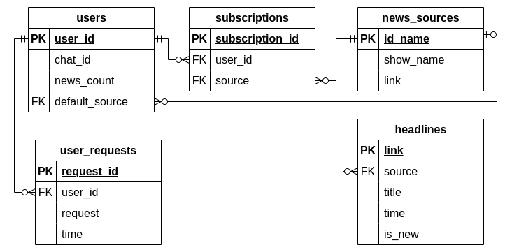
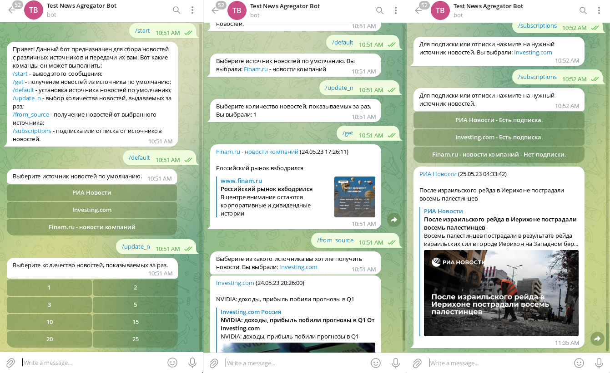

# Telegram бот для агрегации новостей

Это бот для telegram, который собирает заголовки новостей с разных сайтов и отправляет пользователю по запросу или по подписке. 
Приложение состоит из трёх частей, объединённых с помощью docker compose:

---

1) База данных `PostgreSQL`, в которой хранится информация о пользователях, новостных источниках и заголовках. Доступ к базе данных осуществляется с помощью `SQLAlchemy`. Схема базы данных представлена на следующем рисунке, а подробная информация о таблицах с данными представлена в виде объектов SQLALchemy в файле `table_models.py`.

---

2) Агрегатор новостей (каталог `news_agregator/`) - собирает новости с сайтов с помощью скрапинга и библиотеки `beautifulsoup4` и сохраняет их в базу данных. Реализованные источники новостей:  

    + **РИА Новости** - все новости, с помощью парсинга RSS канала.
    + Срочные новости от **Investing.com** - с помощью парсинга html страницы.
    + Новости компаний от **Finam.ru** - новости только от Finam.ru, от других авторов новости фильтруются, сбор данных реализуется с помощью парсинга RSS канала.

---

3) Телеграм бот (каталог `telegram_bot/`) - осуществляет взаимодействие с пользователем, показывает новостные заголовки, сохраняет информацию о пользователе и его действиях. Работает асинхронно - в одном потоке сам бот, реализованный с помощью библиотеки `pyTelegramBotAPI`, а в другом - проверка базы данных на наличие новых заголовков. Поддерживаемые комманды: 
+ `/start` - вывод приветственного сообщения;
+ `/get` - получение новостей из источника по умолчанию;
+ `/default` - установка источника новостей по умолчанию;
+ `/update_n` - выбор количества новостей, выдаваемых за раз;
+ `/from_source` - получение новостей от выбранного источника;
+ `/subscriptions` - подписка или отписка от источников новостей.

---

## Запуск

Для запуска необходимо установить `docker`, скачать проект, и выполнить два шага:
1. В файле `docker-compose.yml` вписать [API токен бота](https://tgfaq.ru/chto-takoe-token-bota.html) (строка **41**).
2. В каталоге с проектом запустить команду `docker-compose up`.

Для завершения работы используется команды `docker-compose down` в том же каталоге.

